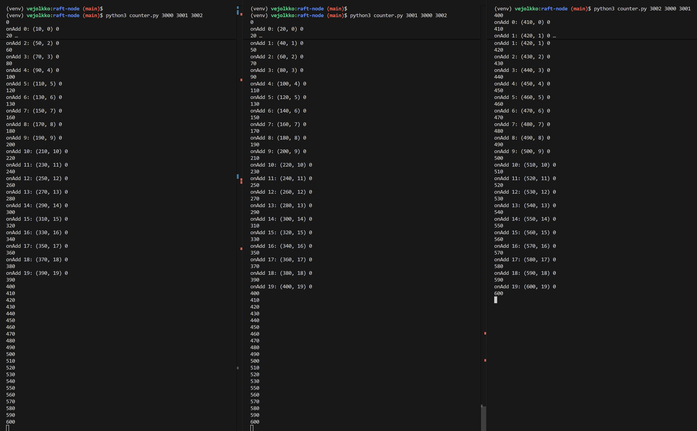

# Distributed Seat Reservation System

## How to Run the Raft Nodes Locally

This project includes a simple distributed counter implemented with the
[PySyncObj](https://github.com/bakwc/PySyncObj) library.  
Each instance acts as a Raft node that participates in leader election and state replication.

Below are the steps for running three Raft nodes locally on your machine.

---

## 1. Install Python

1. Make sure you have **Python 3.10.12** installed.
   - Other Python 3.x versions may also work, but the application has been tested specifically with 3.10.12.
   - Check your Python version using:  
     `python --version` or `python3 --version`

---

## 2. Clone the Repository

1. Clone this repository to your local machine.
   - If you are a collaborator, you can use SSH:  
     `git clone git@github.com:vejol/distributed-seat-reservation-system.git`
2. Move into the project directory:  
   `cd distributed-seat-reservation-system`

---

## 3. Set Up a Python Virtual Environment

1. Create a virtual environment:  
   `python3 -m venv raft-node/venv`
   - A virtual environment keeps the project's dependencies isolated from global packages.
2. Activate the environment:  
   `source raft-node/venv/bin/activate`
3. Install the dependencies:
   `pip install -r raft-node/requirements.txt`

---

## 4. About the Example Counter Application

The repository contains a simple counter example in **counter.py**.  
It uses PySyncObj to maintain a replicated global state across the nodes.

Each node follows this logic:

- If **no leader** is elected yet → do nothing.
- Once a **leader exists**:
  - Run a loop 20 times:
    - wait 0.5 seconds
    - increment the global counter by 10
    - print information about the performed increment (lines starting with `onAdd...`)
- Print the current global counter value whenever it changes.

---

## 5. Running the Nodes

To run three nodes with a shared replicated state:

1. Open **three separate terminal windows**.
2. In each terminal, navigate to the cloned repository and activate the virtual environment with `source raft-node/venv/bin/activate`
3. Start the `counter.py` script with different port parameters:

   - Terminal 1:  
     `python3 raft-node/counter.py 3000 3001 3002`
   - Terminal 2:  
     `python3 raft-node/counter.py 3001 3000 3002`
   - Terminal 3:  
     `python3 raft-node/counter.py 3002 3000 3001`

The script takes **three arguments**:

1. the port on which the current node will run
2. the port of the first partner node
3. the port of the second partner node

This is why each node is started with a slightly different command.

---

## 6. Expected Output

After starting the second and third processes, all terminals should begin showing counter updates as the leader increments the shared value.

Here is an example of what the output may look like:

